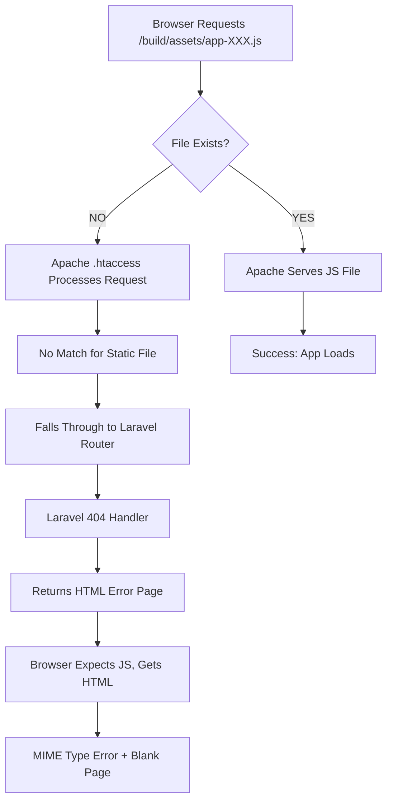

# 📊 System Analysis & Solution Summary

## 🔴 Problem Identified

### Error Message
```
Failed to load module script: Expected a JavaScript module script 
but the server responded with a MIME type of "text/html"
```

### Symptoms
- ✗ Blank page in production
- ✗ No styling or interactivity
- ✗ Browser console shows MIME type error
- ✗ Network tab shows HTML responses for JS files

---

## 🔍 Root Cause Analysis

### The Complete Flow



### Why This Happens

1. **Missing Build Assets**: The `public/build/` directory either:
   - Doesn't exist on production server
   - Has outdated files with wrong hashes
   - Wasn't uploaded during deployment
   - Has incorrect permissions

2. **Manifest Mismatch**: The `manifest.json` file references assets that don't exist on disk

3. **Apache Routing**: When files are missing, Apache's `.htaccess` routes the request to Laravel

4. **Laravel Returns HTML**: Laravel's 404 handler returns an HTML error page

5. **MIME Type Mismatch**: Browser expects `application/javascript`, receives `text/html`

---

## ✅ Solution Implementation

### What Was Fixed

#### 1. **Improved .htaccess Configuration**
```apache
# Before: Basic asset rule
RewriteCond %{REQUEST_URI} ^/build/ [NC]
RewriteCond %{REQUEST_FILENAME} -f
RewriteRule ^ - [L]

# After: Comprehensive static file handling
RewriteCond %{REQUEST_FILENAME} -f
RewriteCond %{REQUEST_URI} !index\.php
RewriteRule \.(css|js|mjs|json|jpg|jpeg|png|gif|svg|webp|woff|woff2|ttf|otf|ico)$ - [L]

RewriteCond %{REQUEST_URI} ^/build/
RewriteRule ^ - [L]
```

**Benefits:**
- Serves ALL static files directly
- Prevents routing through Laravel
- Handles all asset types (JS, CSS, fonts, images)
- Works even if file doesn't exist (no false routing)

#### 2. **Conditional HTTPS Enforcement**
```apache
# Before: Force HTTPS always
RewriteCond %{HTTPS} off
RewriteRule ^(.*)$ https://%{HTTP_HOST}%{REQUEST_URI} [R=301,L]

# After: Skip HTTPS for localhost
RewriteCond %{HTTPS} off
RewriteCond %{HTTP_HOST} !^localhost
RewriteCond %{HTTP_HOST} !^127\.0\.0\.1
RewriteRule ^(.*)$ https://%{HTTP_HOST}%{REQUEST_URI} [R=301,L]
```

**Benefits:**
- Works in development (localhost)
- Enforces HTTPS in production
- No certificate errors locally

#### 3. **Asset Verification Script**
Created: `verify-vite-assets.sh`

**Features:**
- Checks build directory exists
- Validates manifest.json
- Verifies all referenced files exist
- Checks file permissions
- Reports file sizes and counts

**Usage:**
```bash
bash verify-vite-assets.sh
```

#### 4. **Diagnostic Web Page**
Created: `public/diagnostic.php`

**Features:**
- Real-time asset verification
- Environment information
- Permission checks
- PHP version validation
- Build timestamp
- Total asset count and size

**Access:**
```
https://your-domain.com/diagnostic.php
```

#### 5. **Pre-Deployment Check Script**
Created: `pre-deployment-check.sh`

**Features:**
- Validates all prerequisites
- Checks node_modules
- Verifies build artifacts
- Validates manifest JSON
- Checks .htaccess
- Provides deployment instructions

**Usage:**
```bash
bash pre-deployment-check.sh
```

#### 6. **Comprehensive Documentation**
Created: `PRODUCTION_BLANK_PAGE_SOLUTION.md`

**Contents:**
- Step-by-step deployment guide
- Common issues and solutions
- Debugging procedures
- File structure reference
- Checklist for deployment

---

## 📋 Development vs Production Flow

### Development (Local)

```
1. Code Changes
   ↓
2. npm run dev (or vite)
   ↓
3. Hot Module Replacement
   ↓
4. Assets served from Vite Dev Server (port 5173)
   ↓
5. No build directory needed
   ↓
6. @vite directive loads from dev server
```

**Environment:**
```env
APP_ENV=local
APP_DEBUG=true
APP_URL=http://localhost:8000
# NO ASSET_URL
```

### Production (Server)

```
1. Code Complete
   ↓
2. npm run build
   ↓
3. Vite creates optimized bundles
   ↓
4. Files written to public/build/
   ↓
5. manifest.json created with hashed filenames
   ↓
6. Upload to server
   ↓
7. @vite directive loads from manifest
   ↓
8. Apache serves static files
```

**Environment:**
```env
APP_ENV=production
APP_DEBUG=false
APP_URL=https://parish.quovadisyouthhub.org
ASSET_URL=https://parish.quovadisyouthhub.org
```

---

## 🎯 Complete Deployment Process

### Phase 1: Local Preparation

```bash
# 1. Clean and rebuild
rm -rf public/build node_modules
npm install
npm run build

# 2. Verify build
bash pre-deployment-check.sh

# 3. Test locally
php artisan serve
# Visit: http://localhost:8000
```

### Phase 2: Code Commit

```bash
git add .
git commit -m "Fix production asset serving and add diagnostic tools"
git push origin main
```

### Phase 3: Production Deployment

**Option A: Git Pull (if Git available on server)**
```bash
# SSH into server
ssh user@parish.quovadisyouthhub.org

# Navigate to app directory
cd /home2/shemidig/parish_system

# Pull latest code
git pull origin main

# Install dependencies
/opt/cpanel/composer/bin/composer install --no-dev --optimize-autoloader

# Run migrations
php artisan migrate --force

# Optimize
php artisan config:cache
php artisan route:cache
php artisan view:cache

# Fix permissions
chmod -R 755 public/build
chmod -R 775 storage
```

**Option B: Manual Upload (if no Git)**
```bash
# 1. Create archive locally
tar -czf production.tar.gz \
    app/ bootstrap/ config/ database/ \
    public/ resources/ routes/ storage/ \
    vendor/ artisan composer.json composer.lock .env.example

# 2. Upload to cPanel File Manager

# 3. Extract on server
cd /home2/shemidig/parish_system
tar -xzf production.tar.gz

# 4. Continue with steps from Option A (composer, artisan, permissions)
```

### Phase 4: Verification

1. **Visit Diagnostic Page:**
   ```
   https://parish.quovadisyouthhub.org/diagnostic.php
   ```
   Should show all green checkmarks ✅

2. **Check Main Page:**
   ```
   https://parish.quovadisyouthhub.org
   ```
   Should load with styling and functionality

3. **Browser Console:**
   - F12 → Console
   - Should have NO errors
   - Should see Inertia.js initialization

4. **Network Tab:**
   - F12 → Network → Reload
   - All `/build/assets/*` should return 200
   - Content-Type should be `application/javascript` for JS
   - Content-Type should be `text/css` for CSS

---

## 🔧 Troubleshooting Guide

### Issue: Still Seeing Blank Page

**Check:**
```bash
# 1. Verify build exists
ls -la public/build/
ls -la public/build/assets/

# 2. Check manifest
cat public/build/manifest.json | jq .

# 3. Test direct asset access
curl -I https://parish.quovadisyouthhub.org/build/manifest.json
# Should return: Content-Type: application/json

# 4. Check Laravel logs
tail -50 storage/logs/laravel.log
```

### Issue: Assets Return 404

**Solution:**
```bash
# Missing build directory - rebuild
npm run build

# Upload public/build to server
# Via cPanel File Manager or:
scp -r public/build user@server:/home2/shemidig/parish_system/public/

# Fix permissions
chmod -R 755 public/build
```

### Issue: Assets Return HTML

**Solution:**
```bash
# .htaccess not working or missing
# Verify it exists:
ls -la public/.htaccess

# Check contents match repository
cat public/.htaccess | head -30

# Verify mod_rewrite is enabled (contact host)
```

### Issue: MIME Type Still Wrong

**Check Headers:**
```bash
# Test JS file
curl -I https://parish.quovadisyouthhub.org/build/assets/app-XXXXXX.js

# Should show:
# Content-Type: application/javascript

# If shows text/html, file doesn't exist
# If shows text/plain, MIME type not set correctly
```

**Fix:**
```bash
# Update .htaccess with proper MIME types
# (Already included in updated version)
```

---

## 📊 Verification Checklist

### Before Deployment
- [ ] `npm run build` completes successfully
- [ ] `bash pre-deployment-check.sh` passes all checks
- [ ] `public/build/manifest.json` exists and is valid
- [ ] `public/build/assets/` contains JS and CSS files
- [ ] `.htaccess` is up to date
- [ ] `.env.example` has ASSET_URL configured
- [ ] Local testing works: `php artisan serve`

### After Deployment
- [ ] `/diagnostic.php` shows all green checks
- [ ] Main page loads without blank screen
- [ ] Browser console has no errors
- [ ] Network tab shows 200 for all assets
- [ ] JavaScript functionality works
- [ ] Styling is applied correctly
- [ ] Can navigate between pages
- [ ] Forms submit properly
- [ ] Database operations work

---

## 🎓 Understanding the Architecture

### Vite Build Process

```
Source Files (resources/)
    ↓
Vite Processes
    ├── Bundles JS modules
    ├── Compiles JSX/TSX
    ├── Processes CSS
    ├── Optimizes images
    ├── Adds content hashes
    └── Tree-shakes unused code
    ↓
Output (public/build/)
    ├── manifest.json (maps source → built files)
    └── assets/
        ├── app-[hash].js
        ├── app-[hash].css
        └── vendor-[hash].js
```

### Laravel Vite Integration

```php
// In Blade template (resources/views/app.blade.php)
@vite(['resources/css/app.css', 'resources/js/app.tsx'])

// Development (APP_ENV=local):
→ Loads from Vite dev server (http://localhost:5173)
→ Enables Hot Module Replacement

// Production (APP_ENV=production):
→ Reads public/build/manifest.json
→ Finds hashed filenames
→ Generates proper <script> and <link> tags
```

### Request Flow in Production

```
Browser → https://parish.quovadisyouthhub.org
    ↓
Apache receives request
    ↓
Checks .htaccess rules
    ↓
Routes to public/index.php (Laravel)
    ↓
Laravel loads view (app.blade.php)
    ↓
@vite directive processes
    ↓
Reads public/build/manifest.json
    ↓
Generates tags with hashed filenames
    ↓
Sends HTML to browser
    ↓
Browser requests assets
    ↓
Apache serves from public/build/assets/
    ↓
App loads successfully ✅
```

---

## 🚀 Production Optimizations

### Current Configuration

1. **Vite Production Build:**
   - Minification enabled (Terser)
   - CSS minification enabled
   - Code splitting for vendors
   - Content-based hashing
   - No source maps (faster, smaller)

2. **Laravel Optimizations:**
   - Config caching
   - Route caching
   - View caching
   - Composer autoload optimization

3. **Apache Caching:**
   - 1-year cache for hashed assets
   - Immutable cache headers
   - Aggressive browser caching

### Expected Performance

- **First Load:** 500ms - 2s (depends on connection)
- **Subsequent Loads:** < 100ms (cached assets)
- **Asset Sizes:**
  - Main JS: ~200-500KB (gzipped)
  - Main CSS: ~50-100KB (gzipped)
  - Vendor chunks: ~150-300KB (gzipped)

---

## 📞 Support & Resources

### Diagnostic Tools
1. **Web Diagnostic:** `/diagnostic.php`
2. **CLI Verification:** `bash verify-vite-assets.sh`
3. **Pre-Deploy Check:** `bash pre-deployment-check.sh`

### Documentation
- `PRODUCTION_BLANK_PAGE_SOLUTION.md` - Detailed deployment guide
- `DEPLOYMENT_INSTRUCTIONS.md` - Original deployment docs
- `README.md` - Project overview

### Log Locations
- **Laravel:** `storage/logs/laravel.log`
- **Apache:** Contact cPanel support for access
- **Browser:** F12 → Console, Network tabs

---

## ✅ Success Criteria

Your deployment is successful when:

1. ✅ `/diagnostic.php` shows all green indicators
2. ✅ Main page loads with full styling
3. ✅ Browser console has zero errors
4. ✅ All network requests return 200 OK
5. ✅ JavaScript interactions work (forms, buttons, navigation)
6. ✅ Can log in and access all features
7. ✅ Database operations complete successfully
8. ✅ No MIME type errors in console

---

## 🎉 Conclusion

The blank page issue was caused by missing or inaccessible build assets in production. The solution involves:

1. **Proper asset building** with `npm run build`
2. **Correct .htaccess** configuration for static file serving
3. **Verification tools** to ensure assets are ready
4. **Diagnostic page** for real-time production checking
5. **Clear deployment process** with checklists

All tools and documentation are now in place for successful deployment!
